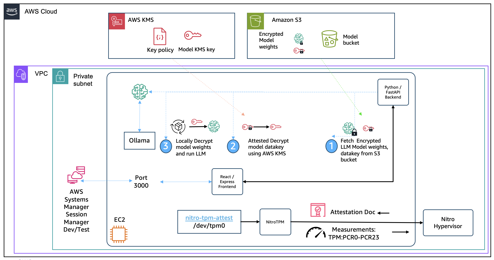

# MPC Application with AWS NitroTPM

## Multi-Party LLM Collaboration sample

This is a sample application that showcases how secure collaboration between LLM model owners and consumers can be achieved using [AWS NitroTPM](https://docs.aws.amazon.com/AWSEC2/latest/UserGuide/nitrotpm.html) and [EC2 instance attestation](https://docs.aws.amazon.com/AWSEC2/latest/UserGuide/nitrotpm-attestation.html).

> [!note]
> This application offers all the functionalities in one web application user interface for "ease of use" in learning the fundamentals around attestation based sealing, unsealing and other primitives. Application is not authenticating, authorizing or separating the roles and responsibilities of each party. Application is also not showing how to build an Isolated compute environment.

### Core Functionality

#### **LLM Model Owner** (Party A)
- **Model Manager**: Download models from Hugging Face, envelope encrypt with AWS KMS, and upload to S3.
- **Seal Model Weights**: Create and manage KMS keys with conditional attested decrypt (and other operations) with TPM PCRs.
- **Published Models**: View and manage encrypted models stored in S3 buckets.

#### **LLM Model Consumer** (Party B)
- **Loaded Models**: View currently loaded models in Ollama with their integrity hashes
- **Model Loader**: Securely download and decrypt models using TPM attestation
- **Chat Interface**: Interactive chat with loaded models, with PCR verification display

#### **EC2 Instance Attestation**
- **Attestation Document Viewer**: Display and verify EC2 Instance attestation documents.
- **PCR Measurements**: View Platform Configuration Register values (PCR4, PCR7, PCR12, PCR15 and others)
- **Cryptographic Verification**: Validate attestation document signatures and certificates

#### **Environment**
- **Instance Metadata**: AWS EC2 instance information and IAM details
- **GPU Information**: Available to aide in development and testing: NVIDIA GPU status, memory usage, and CUDA capabilities
- **System Debug**: Available to aide in development and testing, system diagnostics, network status, and service health

### Key Security Features

1. **Hardware-Backed Attestation**: Uses EC2 instance attestation for cryptographic proof of execution environment
2. **Sealed Encryption**: Model weights encrypted with AWS KMS and sealed to specific AWS NitroTPM PCR measurements
3. **Multi-Layer Verification**:
   - **PCR4/PCR7**: Boot integrity measurements
   - **PCR15**: Model-specific integrity measurements
4. **Zero-Trust Architecture**: Enables further packaging and building an Amazon EC2 machine image (AMI) that both parties can measure and verify using attestation before trusting the environment. The packaging samples that take this sample app and create an [Isolated execution environment](https://docs.aws.amazon.com/AWSEC2/latest/UserGuide/isolate-data-operators.html) AMI will be made available in separate sample repos.

### Use Case
Enables secure AI model sharing where:
- **Model owners** can protect their intellectual property while making models available to their consumers.
- **Model consumers** can verify they're running authentic models in a isolated compute environment that mitigates exfiltration of inputs to the model.
- **Both parties** maintain cryptographic proof of the execution environment's integrity without revealing each others secrets.

This creates a foundation for secure multi-party collaboration in AI/ML scenarios without requiring either party to fully trust the other.

## Architecture



## Technical Requirements

This application runs on EC2 instances with NitroTPM enabled and uses Ollama with NVIDIA CUDA support. Note that EC2 instance attestation does work on a wide range on instance families including accelerated compute. For a full list of instance types refer [here](https://docs.aws.amazon.com/AWSEC2/latest/UserGuide/enable-nitrotpm-prerequisites.html#nitrotpm-instancetypes). 

## Setup AWS services

### Create Amazon S3 bucket

Take a look at the script below that creates a Amazon S3 bucket to be used for storing the LLM Model weights.  
> [!note]
> Note down the Amazon S3 bucket name. You would need it when using the MPC Application.

```bash
chmod +x ./dev_build/scripts/*.sh
./dev_build/scripts/create_s3_bucket.sh --bucket <replace-with-bucket-name> --region us-east-2
```

### Create AWS IAM Role and instance profile
Execute the following script that creates an IAM role to be used as the EC2 instance role. Carefully examine the permissions the policies in this role provide the EC2. For the purpose of this sample app functionality it should be at a minimum Amazon S3 bucket/object CRUD and AWS KMS GenerateDataKey, Decrypt, GetKeyPolicy, PutKeyPolicy, DescribeKey. S3 CreateBucket and KMS CreateKey is strictly not necessary if you do not intend to use that from the frontend. In addition attach the "AmazonSSMManagedInstanceCore" policy if you intend to interactively use this EC2 using AWS Systems manager session manager.
```bash
dev_build/scripts/create_instance_profile.sh --role-name <ec2-instance-role> --profile-name <ec2-instance-profile> --bucket-name <replace-with-bucket-name>
```

### Get Latest G5 AMI
Examine the script below that creates a NitroTPM enabled AMI from the latest AWS AL2023 AMI. Change the AWS region accordingly and execute it. 

>[!tip]
>Note down the AMI ID, you would need it as an input to launching the EC2 instance later. 

>[!important] 
>**NitroTPM enabled AMI is an important pre-requisite for using this sample.**
```bash
./dev_build/scripts/create_tpm_enabled_ami_from_latest_al2023.sh  --arch x86_64 --source-region us-east-2 --dest-region us-east-2
```
### Create AWS KMS Key
Examine the script below and execute it to create a AWS KMS Key to test the frontend app functionality. 
> [!tip]
> Note down the KMS Key ID. You would need it when using the MPC Application.

```bash
./dev_build/scripts/create_kms_key.sh --instance-role <ec2-instance-role-arn-created-above> --region us-east-2
```

### Launch G5 Instance
Launch an EC2 Instance with GPU Acceleration, be ready to supply or create a private subnet with egress (to install ollama, clone the git repo, build dependencies), and a security group that lets you access the instance for dev/test (For example using [AWS Systems Manager Session Manager](https://docs.aws.amazon.com/systems-manager/latest/userguide/session-manager.html)). In this example an SSH key pair is not used with the assumption that the role has the necessary permissions and the security group allows to use AWS Systems manager sesison manager to interactively access the instance from an IDE.

```bash
aws ec2 run-instances \
  --image-id <AMI ID from above> \
  --region us-east-2 \
  --instance-type g5.2xlarge \
  --iam-instance-profile Arn=<Instance profile ARN from above> \
  --subnet-id <Pick an existing private subnet ID with egress> \
  --security-group-ids <Security group ID that allows port 3000 inbound or for AWS SSM agent just outbound> \
  --tag-specifications 'ResourceType=instance,Tags=[{Key=Name,Value=mpc-webapp-test}]' \
  --output json
```

### Logon to the EC2 instance using SSH and/or SSM
Here are the steps specifically for VSCode IDE using remote explorer.
1. Install "Remote - SSH" extension in VS Code
2. Connect to EC2 instance via Remote Explorer
3. Open the cloned repository folder

## Development Setup

Once you have the necessary AWS services setup, SSH or SSM into the EC2 instance and perform the below steps to bring up the application locally.

### 1. Clone repo and Install pre-requisites

**Install pre-reqs**:
```bash
git clone https://github.com/aws-samples/sample-mpc-app-using-aws-nitrotpm.git
cd sample-mpc-app-using-aws-nitrotpm
chmod +x ./dev_build/*.sh
./dev_build/setup.sh
```
### 2. Build and start services

**Build services**:
```bash
./dev_build/build.sh

```

**Start services**:
```bash
# Use the provided script
./dev_build/start-services.sh

# Or start individually
sudo systemctl start ollama-backend
sudo systemctl start ollama-frontend

# Check status of the services
sudo systemctl status ollama-backend
sudo systemctl status ollama-frontend

```

### 4. Port Forwarding
In VS Code:
1. Open Command Palette (Ctrl+Shift+P)
2. Run "Ports: Focus on Ports View"
3. Forward port 3000 (frontend)
4. Access frontend via forwarded port in browser

## Test Application functionality
This sample app is intended to showcase the EC2 instance attestation based sealing, unsealing operations to support collaboration between two parties, for simplicity this app exposes all the functionalities in one place. It is not authenticating, authorizing or separating the roles and responsibilities of each party in distinct execution environments

Using the browser based UI start with

### LLM Model Owner TAB -> Model Manager TAB
1. Model Name and repo would be pre-populated.
2. Input the AWS KMS Key ID created earlier.
3. Input the Amazon S3 bucket name created earlier.
4. S3 Path, set/leave it at "models".
5. Click on the Process Model button.
6. Processing progress will indicate the steps the application backend is performing, most importantly envelope encrypting the downloaded model gguf file and uploading to the S3 bucket specified.

### LLM Model Owner TAB -> Published Models TAB
1. Click refresh to see the s3 objects listed for encrypted model gguf and encrypted datakey created using the AWS KMS.

### LLM Model Owner TAB -> Seal Model weights TAB
1. KMS Key ID should be populated already, if not input it and click next.
2. Notice the UI shows the current KMS Key policy to the right. Add statement(s) to it using the "+ Add Statement" button.
3. Principal ARN would be the IAM role ARN created earlier.
4. Choose Effect as Allow and KMS Action as Decrypt.
5. Click "+ Add condition" under PCR section and choose PCR4.
6. Repeat above step to add PCR7 as another condition.
7. Click "Add Statement" to dismiss the overlay.
8. Click "Update policy" to make updates to the KMS Key policy.

### LLM Model Consumer TAB -> Loaded Models TAB
1. Shows empty before loading.
2. Will show the models loaded to Ollama.

### LLM Model Consumer TAB -> Model Loader TAB
1. Input the S3 bucket where the models were loaded to.
2. Copy the gguf.enc name from the Owner->Published models TAB.
3. Copy the gguf.datakey.enc name from the Owner->Published models TAB.
4. Input the KMS Key ID used earlier to encrypt the models.
5. Input a Model Name
6. Click on "Load Secure Model"
7. Loading progress will show the detailed steps the backend is performing to mainly download the encrypted models, peform an attested decrypt using AWS KMS and the instance attestaiton document fetched using NitroTPM, extending the PCR15 TPM register with the model SHA384 hash and loading the model to ollama.

### LLM Model Consumer TAB -> Chat Interface TAB
1. Notice under Environment TAB -> GPU Information the current vram usage.
2. Chat with the model and observe the usage again.

### EC2 Instance Attestation TAB
1. Observe various components of the attestation document.

## Security

See [CONTRIBUTING](CONTRIBUTING.md#security-issue-notifications) for more information.

## License

This library is licensed under the MIT-0 License. See the LICENSE file.